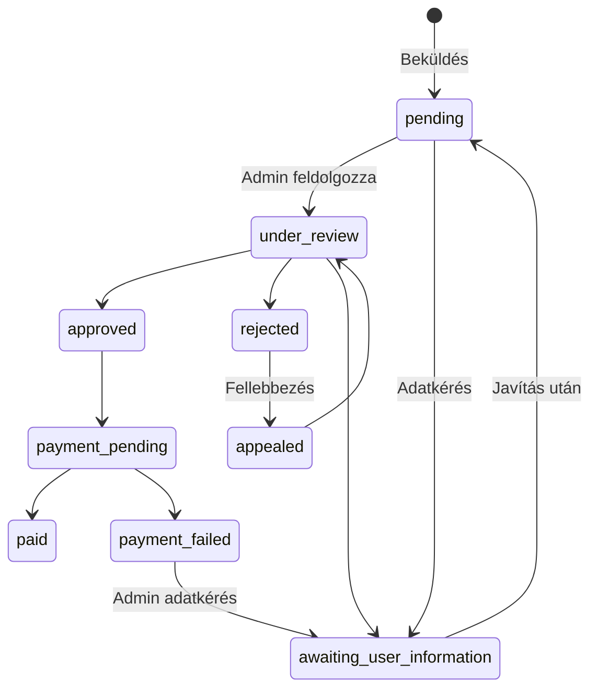
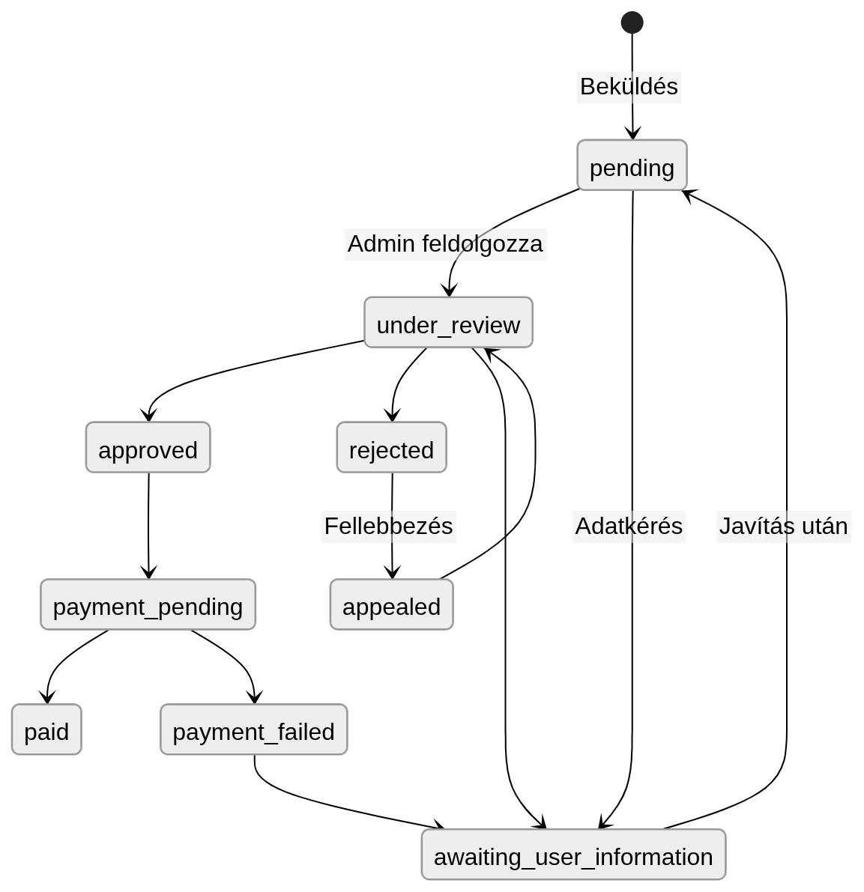

# ECLICK-DEMO

## Telepítés (Docker)

### Előfeltételek

- Telepített Docker + Docker Compose
- A böngésződ tudja kezelni az **`admin.localhost`** domaint. Ha nem működik, add hozzá a hosts fájlhoz:
  `127.0.0.1 admin.localhost`  
  (Linux/macOS: `/etc/hosts`, Windows: `C:\Windows\System32\drivers\etc\hosts`).

### Lépések

1. Környezeti fájl létrehozása:

( vagy csak manuálisan töröld ki a .example részt)
   ```bash
   cp .env.example .env
    
   ```

Docker alatt a `docker-compose.yml` a **backend** szolgáltatásnál felülírja a `DB_HOST`-ot `mysql`-re és a `MAIL_HOST`-ot `mailpit`-re; a `.env`-ben a példa **3308**-as host port a gépről való közvetlen MySQL-eléréshez készült.


2. **PHP image buildelése** (Csak első indításkor vagy Dockerfile módosítás után szükséges.):

   ```bash
   docker compose build
   ```

3. **Konténerek indítása**:

   ```bash
   docker compose up
   ```


4. **Állítsd le** és ha szeretnéd **töröld a compose volume-okat** is (MySQL adat, `node_modules` volume stb. — **minden adat elvész**):

   ```bash
   docker compose down -v
   ```
---

## Elérhető szolgáltatások

| Szolgáltatás             | URL / port | Megjegyzés                                                                                     |
|--------------------------|------------|------------------------------------------------------------------------------------------------|
| **User oldal**           | http://localhost:8080/ | Felhasználói felület (nyugták feltöltése, profil, üzenetek) |
| **Admin oldal**          | http://admin.localhost:8080/ | Admin felület (termékek, promók, nyugták kezelése, refundok)   |
| **Frontend dev szerver** | http://localhost:5173/ | Vite (fejlesztéshez)                                                    |
| **Mail UI**              | http://localhost:8025/ | Bejövő levelek megtekintése                                                                    |
| **Mailpit SMTP**         | `localhost:1025` | Alkalmazás ezt használja (mailpit:1025)                                 |
| **MySQL (hostról)**      | `127.0.0.1:3308` | Felhasználó: `laravel`, jelszó: `secret`                                    |

### Demo belépési adatok

| Szerep | E-mail | Jelszó |
|--------|--------|--------|
| User   | `user@test.com` | `admin123!` |
| Admin  | `admin@test.com` | `admin123!` |

A jelszó módosítható a SEED_DEMO_PASSWORD env változóval..

---

## Architektúra (fontosabb döntések)

| Terület                | Döntés                                                                                 | Rövid indoklás                                                                                                                                                                          |
|------------------------|----------------------------------------------------------------------------------------|-----------------------------------------------------------------------------------------------------------------------------------------------------------------------------------------|
| **Két Filament panel** | `admin`  és `account` külön hoston / útvonalakon                                       | Az admin felület és a felhasználói felület teljesen el van választva. Külön bejelentkezésük van, és külön jogosultságok vonatkoznak rájuk. Ez jól szemlélteti a multi-tenancy alapjait. |
| **Domain + host**      | `APP_MAIN_DOMAIN` + `FILAMENT_ADMIN_DOMAIN` (pl. `localhost` / `admin.localhost`)      | A `bootstrap/app.php` és az nginx ugyanazon a 80-as porton különbözteti meg a kérések célját a `Host` fejléc alapján.                                                                   |
| **Adatmodell**         | Promóciók, termékek, nyugták, tételek, visszatérítések, üzenetek                       | Egy nyugta egy promócióhoz és egy felhasználóhoz kötött; promóciók - termékek: (many to many) .                                                                                         |
| **Üzleti logika**      | `App\Services\…`, `App\Contracts\…`, `App\Domain\…` (enumok, kivételek)                | A státuszokat enumokkal (pl. ReceiptSubmissionStatus) kezeljük, így típusbiztos és átlátható.                                                                                           |
| **Háttérfolyamatok (queue)**  | `database` queue driver; külön worker konténerek (mail, képfeldolgozás, refund export) | A hosszabb feladatok (pl. e-mail küldés, képfeldolgozás, csv létrehozás + export) háttérben futnak. Egyszerű Docker setup.                                                              |
| **E-mail kezelés**     | SMTP → Mailpit                                                                         |Fejlesztés közben minden kiküldött e-mail a Mailpit felületén nézhető meg, nem megy ki valódi címekre.                                                                                                                                            |
| **Médiafeldolgozás**   | Feltöltés → staging → job → végleges  JPEG; MIME + raster ellenőrzés                   | A feltöltött képek először ideiglenes helyre kerülnek, majd egy háttérfolyamat dolgozza fel őket (pl. átméretezés, formátum ellenőrzés), így nem lassítják a felhasználói kérést.                                                                                                         |
| **Jogosultságkezelés** | Laravel Policy-k + Filament + Spatie role (`UserRole`)                                 | Az admin és a sima felhasználók jogosultságai külön vannak kezelve, szerepkörök (pl. UserRole) alapján.                                                                                                                  |

---

## Nyugta feldolgozási folyamat

Az egyes státuszok a `App\Domain\Receipts\ReceiptSubmissionStatus` enumnak felelnek meg.

### Felhasználói oldal (beküldés és javítás)

1. **pending** — A nyugta beérkezett, még nincs feldolgozva.
2. **awaiting_user_information** — Az admin további adatokat kér; a résztvevő a szerkesztő oldalon menthet (megerősítő ablak után), majd a beküldés újra **pending** lesz.
3. **payment_failed** — Sikertelen banki utalás; a résztvevő szerkesztheti a beküldést (és a profilban a bankszámlát). Mentés megerősítése után a státusz **pending**-re válik.
4. **rejected** — Elutasítva; **nincs szerkesztés**, a résztvevő egyszer fellebbezhet (**appealed**).
5. **appealed** — Fellebbezés elküldve; az admin újra megvizsgálhatja.

### Admin / operátori folyamat 

A ReceiptWorkflowService irányítja:

- **pending**, **appealed** vagy **awaiting_user_information** → **under_review** („Move to under review”).
- **under_review** → **approved** / **rejected** (indoklással) / **awaiting_user_information** (utasítással).
- **approved** → ha bekerül egy refund export batch-be, a feldolgozás **payment_pending**-re állítja a nyugtát (és létrehozza a `refund_export_items` sorokat).
- **payment_pending** → **paid** (manuális „transfer completed”) vagy **payment_failed** (manuális banki üzenet megadásával).
- **payment_failed** → opcionálisan **awaiting_user_information** (résztvevői adatjavítás), vagy a résztvevő közvetlenül szerkeszt és ment → **pending**; onnan újra az értékelési kör.

### Összefoglaló ábra (fő ágak)






> A pontos átmenetek és validációk mindig a `ReceiptWorkflowService` és a résztvevői `UserReceiptParticipantService` kódja szerint érvényesek.

---
